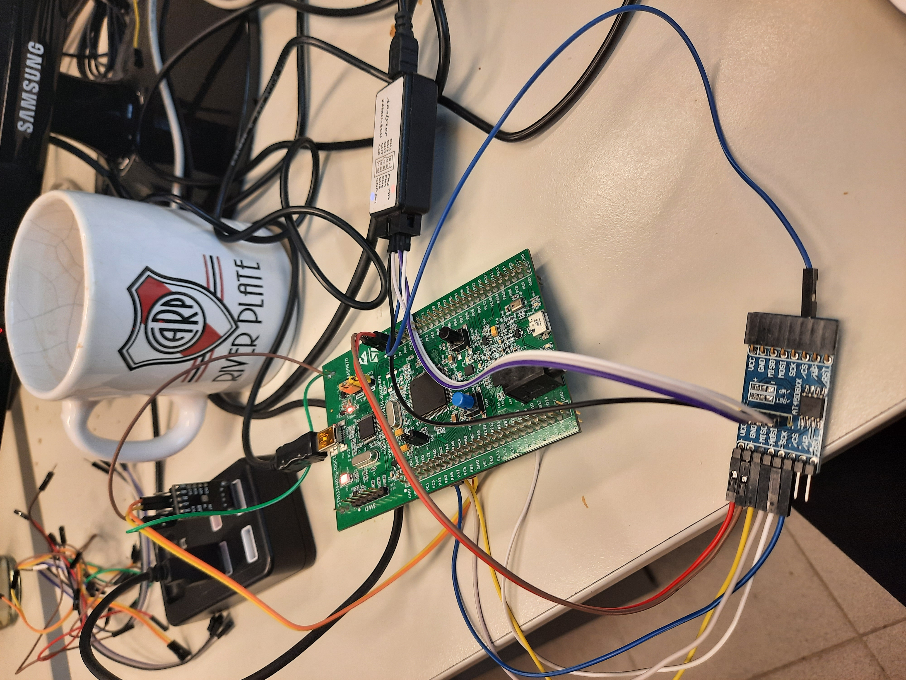
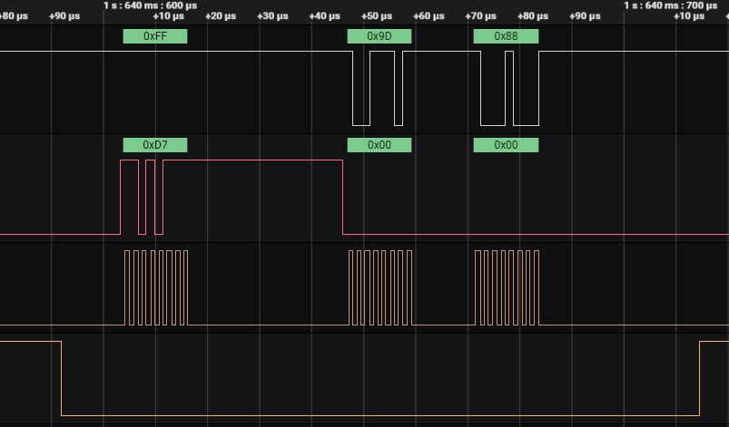

#Driver for AT45DB041 based in STM32 HAL

Controller for flash memory AT45DB041. Based on the STM32 HAL project but the code is easy to modify and use on another platform.

 <h4 align="center">Component Connection</h4>
 

<h4 align="center">Signal fromlogic analyzer
</h4>

 Command 0xD7 is sent to obtain the 2 status registers: |0x9D | 0x88|

 

