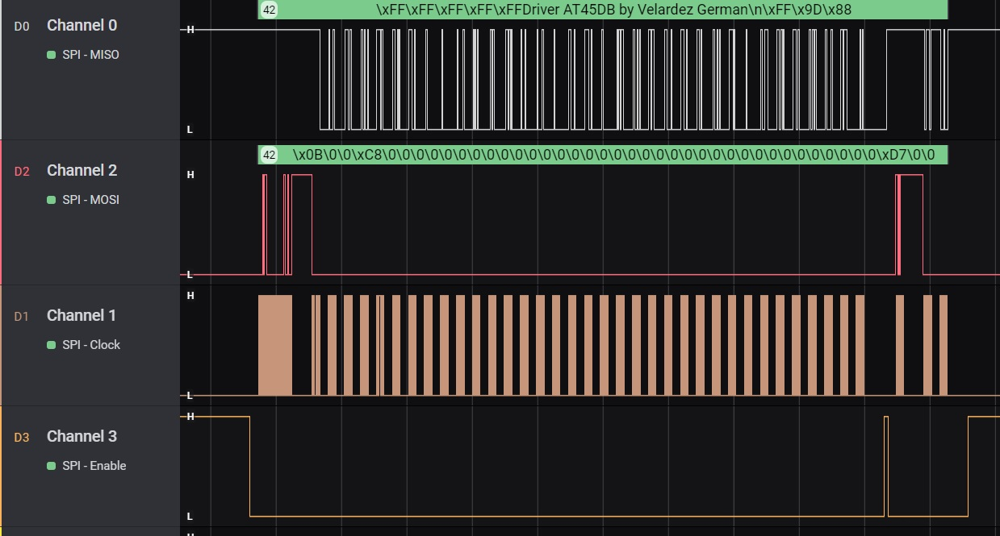

#Driver for AT45DB041 based in STM32 HAL

Controller for flash memory AT45DB041. Based on the STM32 HAL project but the code is easy to modify and use on another platform.

 <h4 align="center">Component Connection</h4>
 

<h4 align="center">Signal from logic analyzer
</h4>

 Command 0xD7 is sent to obtain the 2 status registers: |0x9D | 0x88|

 

<h4 align="center">Signal from logic analyzer
</h4>

 Command 0x9F is sent to obtain the 4 ID registers: |0x1F|0x24|0x00|0x01|

 

<h4 align="center">Signal from logic analyzer
</h4>

 Write page throught buffer1 (0x82) with data = "Driver AT45DB by German Velardez\n"

 

<h4 align="center">Signal from logic analyzer
</h4>

 Read page with command: 0x0B 

 

